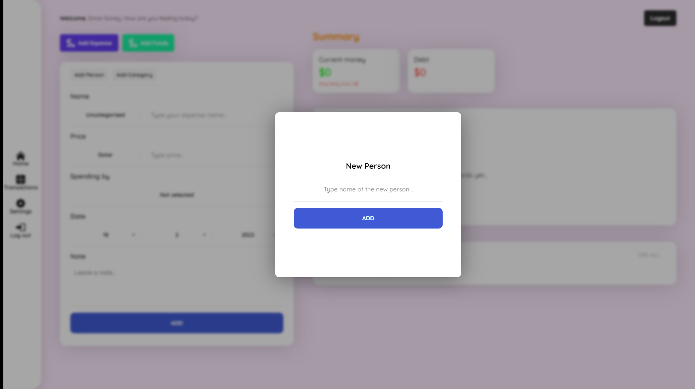

# MERN React Budget Planner App

A powerful, elegance and MERN Full-Stack, budget planning app written in React.JS

## Take a look;

Here is [DEMO](https://mern-react-budget-planner-app.netlify.app/)!

## Specs;

- Adding expense and income,
- Montly and daily chart,
- Membership system,
- Live currency converter,
- Dark theme (Coming soon),
- Responsive design,
- CSS Animations,
- And much more...

## Built with;

- [React](https://tr.reactjs.org/)
- [React Hooks](https://reactjs.org/docs/hooks-intro.html)
- [Redux](https://redux.js.org/)
- [React Router](https://reactrouter.com/)
- [MongoDB](https://mongodb.com/)
- [Express](https://expressjs.com/)
- [NodeJS](https://nodejs.org/)
- [Axios](https://axios-http.com/)
- [JWT](https://jwt.io/)
- [Sass](https://sass-lang.com/)
- [React Minimal Pie Chart](https://github.com/toomuchdesign/react-minimal-pie-chart/)
- [Free Currency API](https://freecurrencyapi.net/)

## Contributing;

- If you have problems please leave an issue from [here](https://github.com/eeguney/mern-react-budget-planner-app/issues/)
- Consider forking the project and submitting new pull requests. I am much likely control [my github account](https://github.com/eeguney/)

## License

This project is licensed under the MIT License - see the [LICENSE](LICENSE) file for details

## ...with love by Emre Güney
